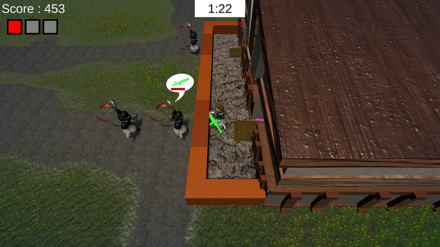

# Sorry, Have You Seen My Loot?

Try to survive the day! Watch out for customers, pay attention to the bell sound, you better serve them the right order or you will get fired! Be careful, the items are ... alive!

## Controls

| Name | PC | Xbox Controller |
| ----- | ----- | ----- |
| Movement | WASD | Joystick |
| Pickup/Drop | K | A |
| Throw | L | B |

## Unity Development

- Unity version 2020.1.0f1
- Sound design made with Wwise

## Author

This game was made during the Global Game Jam 2021 with the collaboration of:

- Programmer: Jordan Huot-Roberge
- Programmer: Frédéric Lévesque
- Programmer: Robayth Shahrin Dhrubo
- Programmer: Asfandyar Butt
- Artist: Daniel Gomez
- Artist: Gerardo Montaño Téllez
- Sound Designer: Antoine de Passillé
- Music Composer: Wil Helm
- Game / Level Designer: Dominic Lachance-Robidoux

## Gameplay video

